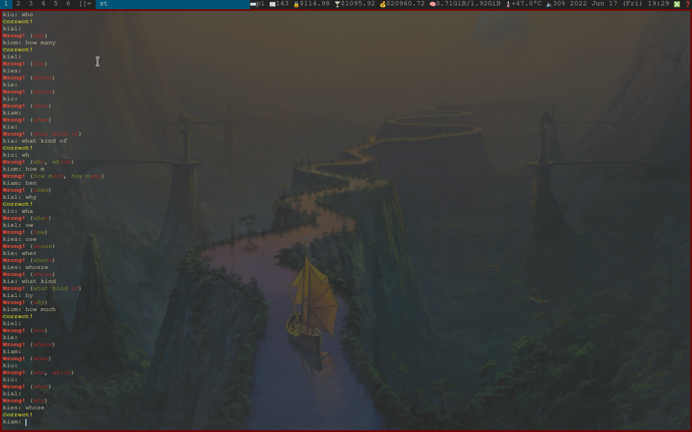

# Simple learning program.

## Usage:
### `./lern.py "formated list with words to learn"`, eg. `./learn.py "wordlist.txt"`

## How to format wordlist?
### "Question: first answer, secound answer, third answer", eg. "What's capital of Switzerland?: Bern, bern, BERN"

# Showcase:
