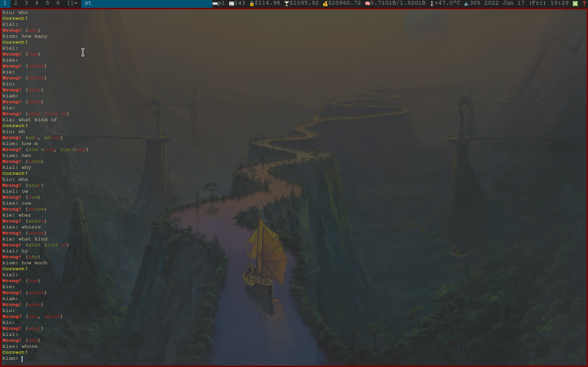

# LEARN
## Simple learning, flashcards like program.

# Usage:
	python learn.py "formated list with words to learn"
# Example:
	python learn.py "wordlist.txt"

# FAQ:
## How to format wordlist?
## "Question: first answer, secound answer, third answer"
### Example: "What's capital of Switzerland?: Bern, bern, BERN"

# Showcase:

